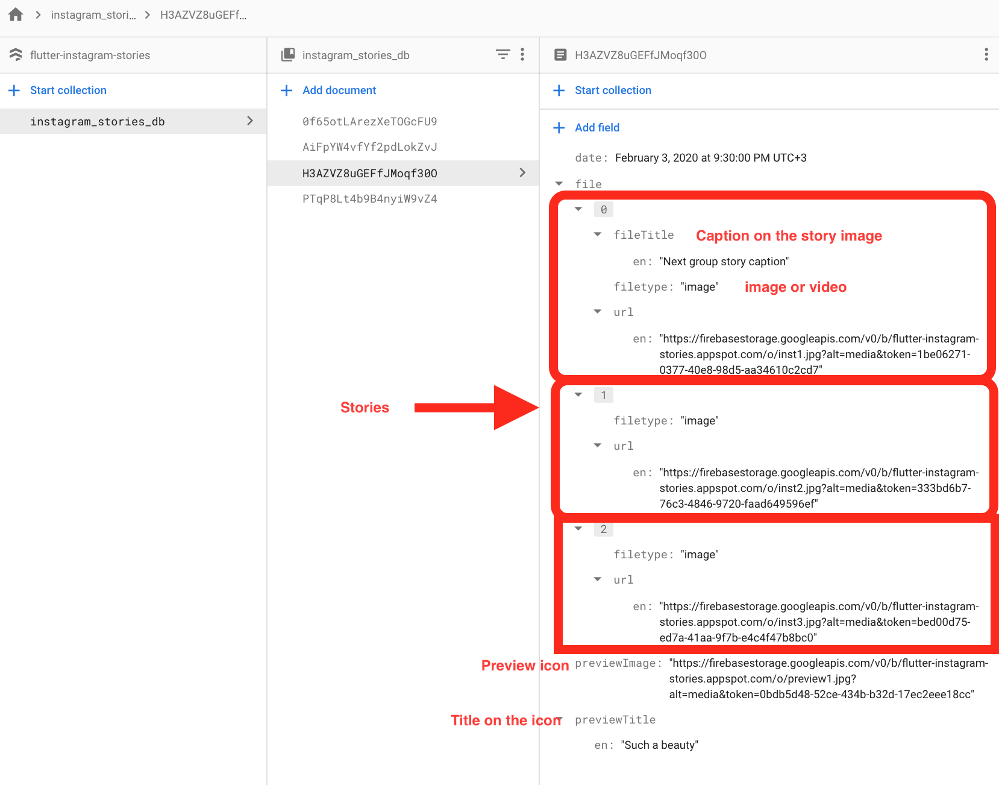

# flutter_instagram_stories [](https://pub.dev/packages/flutter_instagram_stories)


A Flutter package for displaying stories just like Whatsapp & Instagram. Built-in groups (multiple stories with one icon), cache, video, gifs.

The package can be used in any app for displaying news, educational content and etc. [Look the sample app here](https://github.com/awaik/flutter_instagram_stories/blob/master/example/lib/main.dart).


*Note*: This package is under active development, and there are some known bugs and a lot of features to implement. Please, add issues or feature requests here: [issue](https://github.com/awaik/flutter_instagram_stories/issues)

The project was initially copied from https://github.com/blackmann/story_view - great thanks for this excellent package. In case, you need more flexible functionality, you can check the original repository.


*Important notes:*

1. For now, the package works with Firebase only.
2. This is a first beta version, please add all issues and feature requests here: [issue](https://github.com/awaik/flutter_instagram_stories/issues)


## Features

* Only one line of code to implement this package to the app.
* Display images, gifs, videos.
* Adjustable titles on icons.
* Preliminary caching after app started.
* Multilanguage support.
* Callback when a user closed stories - helps to implement subscriptions after first launch and etc.

## Installing

Look how to install here [https://pub.dev/packages/flutter_instagram_stories#-installing-tab-](https://pub.dev/packages/flutter_instagram_stories#-installing-tab-)

Now in your Dart code, you can use:

```dart
import 'package:flutter_instagram_stories/flutter_instagram_stories.dart';
```

## iOS

For playing video, the package uses official video_player https://pub.dev/packages/video_player

From documentation:

1.  Warning: The video_player plugin doesn’t work on iOS simulators. You must test videos on real iOS devices.

2. For iOS, add the following to the Info.plist file found at <project root>/ios/Runner/Info.plist.

```
<key>NSAppTransportSecurity</key>
  <dict>
    <key>NSAllowsArbitraryLoads</key>
    <true/>
  </dict>
```

## Usage


You can find a complete working example here https://github.com/awaik/flutter_instagram_stories/tree/master/example

*Dart code*

Connect to the collection where you keep stories

```dart
    static String collectionDbName = 'instagram_stories_db';
    CollectionReference dbInstance =
      Firestore.instance.collection(collectionDbName);
```

And add stories full functionality to your app.

```dart
    FlutterInstagramStories(
        collectionDbName: collectionDbName,
        showTitleOnIcon: true,
        backFromStories: () {
          _backFromStoriesAlert();
        },
        iconTextStyle: TextStyle(
          fontSize: 14.0,
          color: Colors.white,
        ),
        iconImageBorderRadius: BorderRadius.circular(15.0),
        iconBoxDecoration: BoxDecoration(
          borderRadius: BorderRadius.all(Radius.circular(15.0)),
          color: Color(0xFFffffff),
          boxShadow: [
            BoxShadow(
              color: Color(0xff333333),
              blurRadius: 10.0,
              offset: Offset(
                0.0,
                4.0,
              ),
            ),
          ],
        ),
        iconWidth: 150.0,
        iconHeight: 150.0,
        textInIconPadding:
            EdgeInsets.only(left: 8.0, right: 8.0, bottom: 12.0),
        //how long story lasts in seconds
        imageStoryDuration: 7,
        progressPosition: ProgressPosition.top,
        repeat: true,
        inline: false,
        languageCode: 'en',
        backgroundColorBetweenStories: Colors.black,
        closeButtonIcon: Icon(
          Icons.close,
          color: Colors.white,
          size: 28.0,
        ),
        closeButtonBackgroundColor: Color(0x11000000),
        sortingOrderDesc: true,
        lastIconHighlight: true,
        lastIconHighlightColor: Colors.deepOrange,
        lastIconHighlightRadius: const Radius.circular(15.0),
        captionTextStyle: TextStyle(
          fontSize: 22,
          color: Colors.white,
        ),
        captionMargin: EdgeInsets.only(
          bottom: 50,
        ),
        captionPadding: EdgeInsets.symmetric(
          horizontal: 24,
          vertical: 8,
        ),
      ),
```

*Firestore database*

The package works with Firestore database and package https://pub.dev/packages/cloud_firestore already included into the package.

You can use [example](https://github.com/awaik/flutter_instagram_stories/blob/master/example/lib/main.dart) with the sample database in the example folder, or, create your own database.

Steps to create:

1. Add Firebase to your app

- Android https://firebase.google.com/docs/flutter/setup?platform=android
- iOS https://firebase.google.com/docs/flutter/setup?platform=ios

2. Create Firestore database

- Create a collection with any name. After you will use this name in dart code only once.
- Create documents inside the collection with exact structure, like on the image below



That's it! Now your app has instagram stories with caching and other powerful features.

## Use cases in real apps

App for Android and iOS - https://lifext.app/


