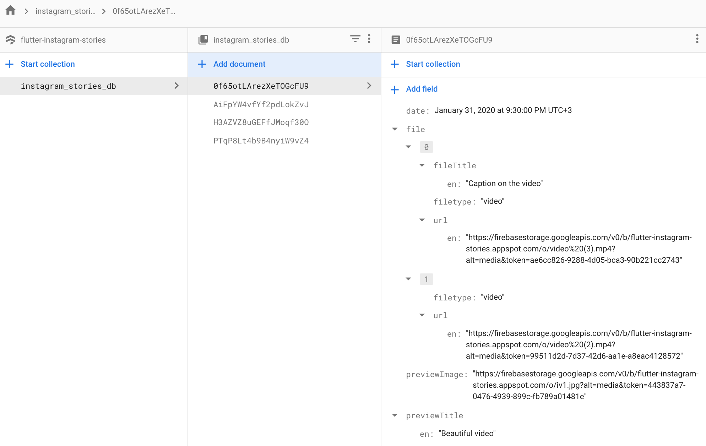

# flutter_instagram_stories

[](https://pub.dartlang.org/packages/camera)

A Flutter plugin for displaying stories just like Whatsapp & Instagram. Built-in groups (multiple stories with one icon), cache, video, gifs.

Plugin can be used in any app for displaying news, educational content and etc.


*Note*: This plugin is under ative development, and there are some known bugs and a lot of features to implement. Add issues or feature requests here: [issue](https://github.com/awaik/flutter_instagram_stories/issues)


*Important notes:*

1. For now plugin works with Firebase only.
2. This is first beta version, please


# Features

* Only one line of code to implement this plugin to app
* Display images, gifs, videos
* Adjustable titles on icons
* Preliminary caching after app started

## Installing

```yaml
dependencies:
  flutter_instagram_stories: ^0.1.0
```

Now in your Dart code, you can use:

```dart
import 'import 'package:flutter_instagram_stories/flutter_instagram_stories.dart';';
```

## iOS

For playing video plugin uses official video_player https://pub.dev/packages/video_player

From documentation:

1.  Warning: The video_player plugin doesn’t work on iOS simulators. You must test videos on real iOS devices.

2. For iOS, add the following to the Info.plist file found at <project root>/ios/Runner/Info.plist.

	<key>NSAppTransportSecurity</key>
    <dict>
      <key>NSAllowsArbitraryLoads</key>
      <true/>
    </dict>

## Usage


You can find complete working example here https://github.com/awaik/flutter_instagram_stories/tree/master/example

*Dart code*

Connect to collection where you keep stories

```dart
  static String collectionDbName = 'instagram_stories_db';
  CollectionReference dbInstance =
      Firestore.instance.collection(collectionDbName);
```

And add stories full functionality to your app.

```dart
      body: SafeArea(
        child: FlutterInstagramStories(
          collectionDbName: collectionDbName,
          showTitleOnIcon: true,
          fontSizeIcon: 16.0,
          //TODO: showTitleInStory: true,
          //TODO: fontSizeStory: 18.0,
          iconWidth: 150.0,
          iconHeight: 150.0,
          //how long story lasts in seconds
          imageStoryDuration: 7,
          progressPosition: ProgressPosition.top,
          repeat: true,
          inline: false,
        ),
      ),
```

*Firestore database*

Plugin works with Firestore database and package https://pub.dev/packages/cloud_firestore already included into plugin.

You can use example with open database or create your own database.

Steps to create:

1. Add Firebase to your app

- Android https://firebase.google.com/docs/flutter/setup?platform=android
- iOS https://firebase.google.com/docs/flutter/setup?platform=ios

2. Create Firestore database

- Create collection with any name. After you will use this name in dart code only once.
- Create documents inside collection with exact structure, like on image below


```
    DateTime date;
    List file[
        String filetype;
        String url;
        ]
    String title;
    String previewImage;
```



That's it! Now your app has instagram like stories with caching and other powerful features.


